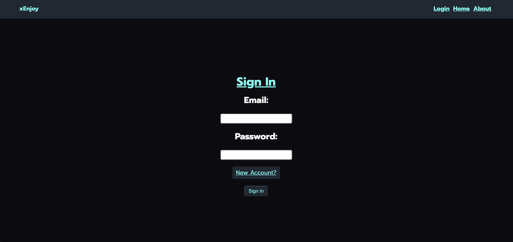

## Date: 10/10/21

#

### By:

#### Micah Stewart

[GitHub](https://github.com/thrillisreal) | [LinkedIn](https://www.linkedin.com/in/micahdstewart/)

**_Description_**

xEnjoy is an in-development app for bookmarking your favorite anime/manga and reviewing other user's favorites!

Development is managed and tracked on [Trello](https://trello.com/b/h59CzDof/xenjoy).

---

**_Technologies Used_**

  - PostgreSQL
  - Express
  - Vue.js
  - Node

**_Getting Started_**

Eventually we will have a direct link here.

---

**_Screenshots_**

##### Sign In/ Sign Up Page

---

##### Create Home Page

---

##### Anime Detail Page

---

---

**_To Do_**

- [x]  Planning
- [x] Everything else

---

**_Credits_**
